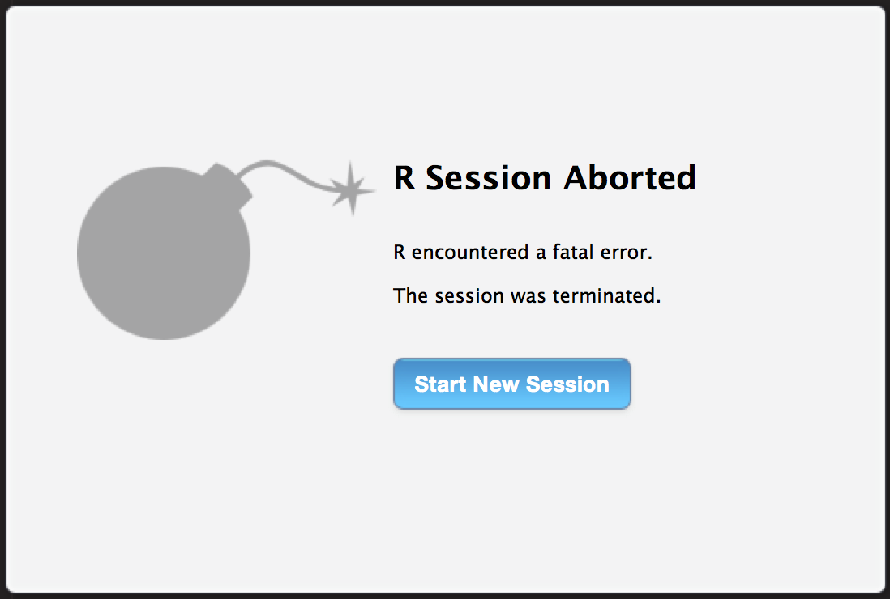

## A Little Bit About Me

> - Software engineer at RStudio; started about 1.5 years ago
> - Completed an MSc. in Statistics at the [University of British Columbia](https://www.ubc.ca/), under the tutelage of [Jenny Bryan](http://www.stat.ubc.ca/~jenny/)
> - Worked briefly in data analytics roles in labs in Vancouver, BC and at the Fred Hutchinson Cancer Research Center in Seattle, WA  (primarily with large genomic datasets)
> - Began programming with `R`; slowly drifted towards `C++` (through [Rcpp](https://github.com/RcppCore/Rcpp)); fiddled with other languages as well

## What I do at RStudio

> - 

> - I primarily work on the IDE itself, but also maintain the [packrat](http://rstudio.github.io/packrat/) package,

> - I read the kind (and mean) things people say on Twitter about the RStudio IDE, and incorporate suggestions / fixes when possible or feasible,

> - I occasionally break the daily builds (for those of you brave enough to try them out...)

## R Code Completion

R code completion has improved drastically in RStudio v0.99, with:

> - Omni-completion, of all variables 'implicitly in scope',

> - Completions for array / matrix dimension names,

> - Completions within so-called 'pipe' chains (with special tooling for dplyr 'verbs'),

> - Improved file completions (recursively list all files within the project),

> - Fuzzy narrowing (be lazy, make spelling mistakes and let RStudio fix it for you)

> - "Inferred" completions (e.g. based on a document's `library()` calls)

## R Code Completion

Back when I was working as a data analyst using RStudio v0.97, it drove me insane that code completion here worked:

        rnorm(n = 1, |
    
but not here:

        rnorm(n = 1,
              |

Why should it matter if my cursor is on a separate line!?

## R Code Completion

This was one of the primary things we wanted to fix with the autocompletion system, but we also wanted to tool it in a way to support popular emerging packages.

For example, packages that make heavy use of non-standard evaluation (NSE), e.g. [dplyr](https://github.com/hadley/dplyr) and [data.table](https://github.com/Rdatatable/data.table), can benefit greatly with improved autocomplete.

But it's also be great if we could have smart autocompletion in other contexts; e.g.

        lm(data = mtcars, |) ## names of 'mtcars', please!

We wanted to improve the autocompletion experience, regardless of what packages you were using.

## R Code Completion -- How it Works

There are a number of challenges in implementing a smart autocompletion system:

> - It needs to be fast (anything over ~100ms is too long),
> - It needs to be robust to 'bad' code (e.g. can't rely directly on `base::parse()`),
> - It should be simple to extend (to handle new idioms that become part of new packages),
> - It should be able to incorporate information from multiple sources (current document, current project, search path...)
> - We need to be careful not to over-aggressively evaluate `R` code.

## R Code Completion -- How it Works

Given a function call like:

```{r, eval=FALSE}
sort_fruits <- function(apple, banana) {
    sort(|)
}
```
    
- What function arguments are in scope?
- What function arguments are available? (What are already used?)
- What elements are available on the search path?
- If `sort()` is a generic function, what method might we actually dispatch to? What arguments does that method accept?
- Given the current 'active argument', what set of actual values does it accept?

## R Code Completion -- How it Works

The general idea for how RStudio's autocompletion works is:

1. Tokenize the current document,
2. Build an autocompletion 'context' from the tokenized document,
3. Dispatch to a method that understands how to provide completions for that context.

Currently, steps 1) and 2) are implemented in the RStudio front-end (in `JavaScript`); however, to make the autocompletion system more robust + extensible we want to move this to the back-end (`R` and `C++`).

Most of 3) is actually implemented in `R` -- let's see what this looks like by debugging our secret entry point, `.rs.rpc.get_completions()`.

## R Code Completion -- Future Goals

The current state of autocompletion in RStudio is pretty good, but we can make it better:

> - Provide a mechanism for package authors to extend the autocompletion system themselves; especially those making heavy use of non-standard evaluation (Like `R`'s own `.DollarNames()`, but for more contexts)

> - Better establish what objects might 'implicitly' be available for a particular context; e.g. handling `source()` calls, and so on.

> - Special handling of more functions (alongside `options()`, `Sys.getenv()`, `data()`, and so on)

## Diagnostics

We probably saw the diagnostics kick in a bit during the demos, as I (inevitably) made errors in the interactive examples.

We now have a system that parses and checks your code in the background, to alert you of errors (or misplaced commas) as soon as we can.

This feature is still a bit in flux -- diagnosing R code is difficult, and nigh-on impossible in the presence of non-standard evaluation.

## Diagnostics -- Goal

The overarching goal in providing diagnostics is to help users find mistakes in their code. This means:

1. Finding code with syntax errors, and highlighting these syntax errors,
2. Finding code that, when executed, will not do what the user thinks / hopes it will do,
3. Finding omissions that may be errors (e.g. unused parameters, unused variables, uses of symbol names that aren't in scope).

In addition, these diagnostics need to be provided fast enough that the user can get real-time feedback as they write `R` code.

## Diagnostics -- Syntax

The simplest place where RStudio can effectively provide diagnostics is within syntax -- for example,

```{r, echo=TRUE, eval=FALSE}
rnorm(
  n = 1,
  mean = 2,
  sd = 3, ## oops -- trailing comma!
)
```

Such errors are relatively easy to diagnose since, when validating syntax, one can usually say "given a token, what tokens can legally follow it given the language?"

Simple, but very effective.

## Diagnostics -- Unintended

There are certain code constructs that we can 'know' are wrong or do not do what the user intended -- for example,

```{r, eval=FALSE}
if (x == NULL) ## wrong way to check if object is NULL
  print("x was NULL")
```

If we truly want to check if an object is `NULL`, then we want to use `is.null()` -- RStudio detects this particular case, but there are certainly numerous other cases where we could be helpful.

This is a bit less simple, since it requires a bit more than just a tokenized representation of the language -- parse trees are helpful here. (If one of the arguments to the `==` function is `NULL`, print diagnostic).

## Diagnostics -- Function Calls

One of the most important, and difficult, errors that RStudio can diagnose is those related to function calls. For example, given a function call e.g. `my_fun(x)`:

- Will the call to `my_fun(x)` succeed?
- Where will the `my_fun()` function actually be resolved? The search path, or a function definition in the same document?
- Are we calling `my_fun()` with the correct number of arguments? Not enough? Too many?
- If `my_fun()` has missing arguments, are they appropriately handled? (Ouch!)

## Diagnostics -- Function Calls

```{r, eval = FALSE}
library(MASS) ## has fn called 'select'
select <- function(x, y) print(x)
select(1)
```

We need to know:

1. What definition of `select()` will actually be called when the document is sourced? (local definition of `select()` masks `MASS::select()`)

2. Will the function call succeed? (argument `y` isn't actually used in the code path executed with those arguments, and so that's fine)

3. Does `select()` perform non-standard evaluation on the passed arguments?

## Diagnostics -- Function Calls

In RStudio, we've adopted the following ideology regarding function call diagnostics -- don't provide wrong diagnostics.

If a function seems to perform non-standard evaluation on its arguments, give up on diagnosing errors due to missing-ness of arguments.

In the future, if a package author provides a function that performs non-standard evaluation, we'd like to have a mechanism that they can use to validate calls to their function (thereby offloading some of the diagnostic burden to package authors).

## Diagnostics -- NSE

We've adopted the following simple convention for deciding whether a particular function performs non-standard evaluation -- if the function is, or calls, a so-called 'non-standard evaluation' primitive, then we shouldn't produce diagnostics.

Some examples: `quote()`, `substitute()`, `library()`, `expression()`, `assign()`...

## Diagnostics -- Making our Lives Easier

Currently, our diagnostics are produced through introspection of function bodies. To get better, we need help from function and package authors.

A mechanism for providing custom type annotations would assist in diagnostics (see e.g. Python's [PEP 0484 -- Type Hints](https://www.python.org/dev/peps/pep-0484/)).

Functions could come with attached validators, that take a particular call and attempt to validate them; e.g.

```{r, eval=FALSE}
attr(f, "validator") <- function(call) { ... }
```

Environments hosting `R` could find calls like `f(1, 2)`, look up the attached validator, and apply it to the existing call.

## Thanks!

- Follow me on [Twitter](https://twitter.com/kevin_ushey).
- Join the [#rstats](https://twitter.com/kevin_ushey) discussions -- we're a friendly bunch!
- Follow RStudio developments on [our blog](http://blog.rstudio.org/).
- Let us know if you have [feature requests](https://support.rstudio.com/hc/en-us) or [bug reports](https://support.rstudio.com/hc/en-us).
